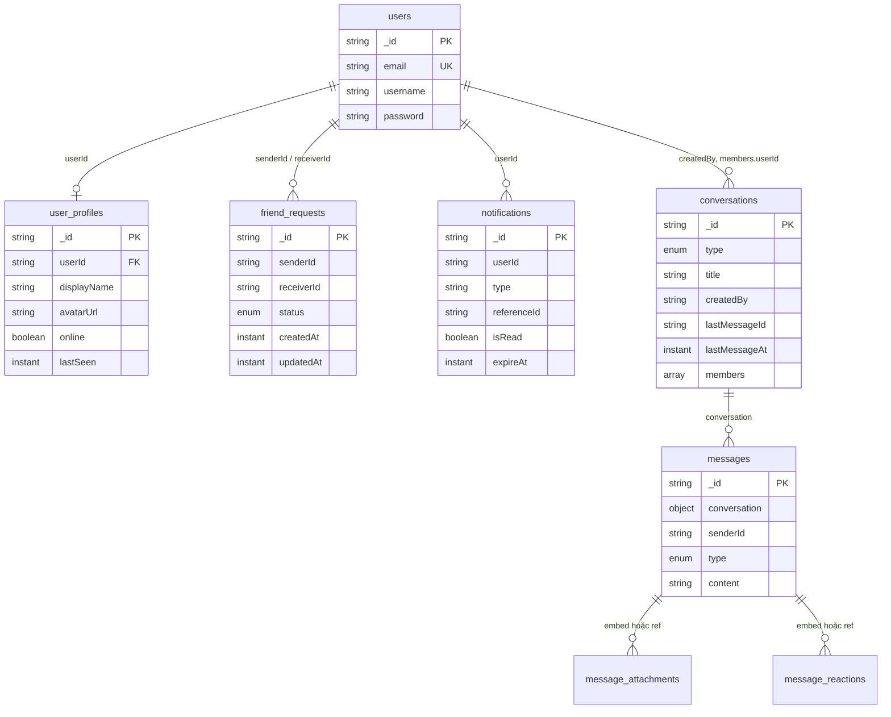

# Database — MyChatApp Backend (legacy MongoDB)

> **Đã migrate:** runtime hiện dùng **PostgreSQL (JPA)** + **DynamoDB** theo [`designDB.md`](./designDB.md).  
> File này giữ lại mô tả MongoDB **trước migrate** để tham chiếu.

Tài liệu mô tả cơ sở dữ liệu **cũ** của `Back-End-NDuy`, suy ra từ entity Spring Data MongoDB trong source code.

---

## Tổng quan

| Thuộc tính | Giá trị |
|------------|---------|
| **Hệ quản trị** | MongoDB (MongoDB Atlas) |
| **Database** | `chat_db` |
| **Mô hình** | Document store, không có FK; liên kết bằng `String` id (`userId`, `senderId`, …) |
| **Service dùng DB** | auth, user (gồm friend), chat, notification |
| **Service không dùng DB** | api-gateway |

Các microservice trên **cùng một database** `chat_db` (shared database).

Cấu hình kết nối (legacy MongoDB): xem tài liệu cũ; runtime hiện dùng PostgreSQL/DynamoDB qua `application.yml` + `Back-End-NDuy/.env`.

---

## Collections

| Collection | Service sở hữu logic | Entity Java |
|------------|----------------------|-------------|
| `users` | auth-service | `User` |
| `user_profiles` | user-service | `UserProfile` |
| `friend_requests` | user-service | `FriendRequest` |
| `conversations` | chat-service | `Conversation` |
| `messages` | chat-service | `Message` |
| `notifications` | notification-service | `Notification` |
| `message_attachments` | chat-service *(định nghĩa entity, chưa có repository)* | `MessageAttachment` |
| `message_reactions` | chat-service *(định nghĩa entity, chưa có repository)* | `MessageReaction` |

---

## Sơ đồ quan hệ (logic)

**Luồng nghiệp vụ liên quan DB (không qua FK):**

1. Đăng ký → ghi `users` → event → tạo `user_profiles` (cùng `userId` = `users._id`).
2. Gửi / chấp nhận kết bạn → `friend_requests` → event → `notifications`, accept → tạo `conversations` (PRIVATE, 2 members).
3. Gửi tin → ghi `messages`, cập nhật `lastMessageId` / `lastMessageAt` trên `conversations`.

---

## Chi tiết từng collection

### 1. `users` — auth-service

Thông tin đăng nhập (credentials).

| Field | Kiểu | Ghi chú |
|-------|------|---------|
| `_id` | String | MongoDB ObjectId string |
| `email` | String | **Unique index** (`@Indexed(unique = true)`) |
| `username` | String | |
| `password` | String | BCrypt hash |

**Repository:** `existsByEmail`, `findByEmail`, `findByUsername`, `existsByUsername`

---

### 2. `user_profiles` — user-service

Hồ sơ hiển thị; tách collection khỏi `users`.

| Field | Kiểu | Ghi chú |
|-------|------|---------|
| `_id` | String | Document id (khác `userId`) |
| `userId` | String | Tham chiếu `users._id` |
| `displayName` | String | Mặc định = username khi đăng ký |
| `avatarUrl` | String | URL CDN (CloudFront/S3); default `static/default-avatar.jpg` khi tạo mới |
| `online` | boolean | Mặc định `false` |
| `lastSeen` | Instant | |

**Repository:** `findByUserId`

**Tạo bản ghi:** RabbitMQ consumer sau event `auth.registered` (không ghi trực tiếp từ auth-service).

---

### 3. `friend_requests` — user-service

Lời mời kết bạn.

| Field | Kiểu | Ghi chú |
|-------|------|---------|
| `_id` | String | |
| `senderId` | String | User gửi lời mời |
| `receiverId` | String | User nhận |
| `status` | Enum | `PENDING`, `ACCEPTED`, `REJECTED` |
| `createdAt` | Instant | `@CreatedDate` *(cần `@EnableMongoAuditing` trên app — hiện chỉ bật ở chat-service)* |
| `updatedAt` | Instant | `@LastModifiedDate` |

**Repository:** `existsBySenderIdAndReceiverIdAndStatus`

---

### 4. `conversations` — chat-service

Phòng chat (1-1 hoặc nhóm).

| Field | Kiểu | Ghi chú |
|-------|------|---------|
| `_id` | String | |
| `type` | Enum | `PRIVATE`, `GROUP` |
| `title` | String | Thường dùng cho GROUP |
| `avatarUrl` | String | |
| `createdBy` | String | `userId` |
| `lastMessageId` | String | Denormalized |
| `lastMessageAt` | Instant | Denormalized |
| `deleted` | Boolean | Mặc định `false` |
| `createdAt` | Instant | Auditing (chat-service) |
| `updatedAt` | Instant | Auditing |
| `members` | Array | Nhúng document `ConversationMember` |

**`ConversationMember` (embedded, không có collection riêng):**

| Field | Kiểu | Ghi chú |
|-------|------|---------|
| `id` | String | |
| `userId` | String | |
| `role` | Enum | `OWNER`, `MEMBER` |
| `nickname` | String | |
| `lastReadMessageId` | String | |
| `lastReadAt` | Instant | |
| `archived` | Boolean | |
| `deleted` | Boolean | |
| `joinedAt` | Instant | |

**Repository:**

- `findByMembers_UserId(userId)`
- `findPrivateConversation(type, userId1, userId2)` — query custom `$all` trên `members.userId`

**Tạo conversation PRIVATE:** consumer RabbitMQ khi `friend.request.accepted`.

---

### 5. `messages` — chat-service

Tin nhắn trong conversation.

| Field | Kiểu | Ghi chú |
|-------|------|---------|
| `_id` | String | |
| `conversation` | Conversation / DBRef | Tham chiếu conversation (object trong code) |
| `senderId` | String | |
| `type` | Enum | `TEXT`, `IMAGE`, `VIDEO`, `FILE` |
| `content` | String | |
| `replyToMessageId` | String | |
| `edited` | Boolean | |
| `deleted` | Boolean | |
| `editedAt` | Instant | |
| `deletedAt` | Instant | |
| `createdAt` | Instant | |
| `attachments` | Array | `MessageAttachment` embedded |
| `reactions` | Array | `MessageReaction` embedded |

**Repository:** `findByConversationIdOrderByCreatedAtAsc` — truy vấn theo id conversation (field lồng trong `conversation`).

**Ghi chú:** `MessageAttachment` và `MessageReaction` cũng có `@Document` collection riêng nhưng **không có repository**; thực tế runtime chủ yếu lưu qua mảng nhúng trong `messages`.

---

### 6. `message_attachments` — chat-service (entity only)

Định nghĩa collection độc lập; có thể trùng với mảng `attachments` trong `messages`.

| Field | Kiểu |
|-------|------|
| `_id` | String |
| `message` | Message (ref) |
| `url` | String |
| `fileName` | String |
| `fileType` | String |
| `size` | Long |
| `width`, `height`, `duration` | Integer |

---

### 7. `message_reactions` — chat-service (entity only)

| Field | Kiểu |
|-------|------|
| `_id` | String |
| `message` | Message (ref) |
| `userId` | String |
| `reactionType` | String |
| `createdAt` | LocalDateTime |

---

### 8. `notifications` — notification-service

Thông báo in-app.

| Field | Kiểu | Ghi chú |
|-------|------|---------|
| `_id` | String | |
| `userId` | String | Người nhận |
| `type` | String | VD: `FRIEND_REQUEST`, `FRIEND_ACCEPTED`, `MESSAGE...` |
| `title` | String | |
| `body` | String | |
| `referenceId` | String | `requestId`, `messageId`, … |
| `isRead` | boolean | |
| `createdAt` | Instant | `@CreatedDate` |
| `expireAt` | Instant | **TTL index** `expireAfterSeconds = 2592000` (30 ngày) |

**Repository:** `findByUserIdOrderByCreatedAtDesc`, `countByUserIdAndIsRead`

**Nguồn dữ liệu:** RabbitMQ từ user-service (`FRIEND_REQUEST`, `FRIEND_ACCEPTED`).

---

## Index đã khai báo trong code

| Collection | Index | Entity |
|------------|-------|--------|
| `users.email` | Unique | `User` |
| `notifications.expireAt` | TTL 30 ngày | `Notification` |

Các collection khác chưa khai báo index trong entity (có thể bổ sung: `user_profiles.userId`, `friend_requests` compound, …).

---

## MongoDB Auditing

| Service | `@EnableMongoAuditing` |
|---------|-------------------------|
| chat-service | Có |
| auth, user, notification | Không |

Ảnh hưởng: `createdAt` / `updatedAt` trên `FriendRequest`, `Notification` có thể **null** nếu không bật auditing hoặc không set thủ công.

---

## RabbitMQ (không lưu trong MongoDB)

Bảng dưới đây mô tả **event** làm thay đổi DB gián tiếp:

| Exchange | Routing key / Queue | Producer | Consumer → DB |
|----------|---------------------|----------|----------------|
| `auth.exchange` | `auth.registered` | auth-service | user-service → `user_profiles`; notification-service → email welcome (SMTP, không DB) |
| `friend.exchange` | `friend.request.sent` | user-service | notification-service → `notifications` |
| `friend.exchange` | `friend.request.accepted` | user-service | notification-service → `notifications`; chat-service → `conversations` |
| `chat.exchange` | `chat.message.sent` | chat-service *(comment / chưa bật)* | — |

---

## Ghi chú kiến trúc

1. **Shared database:** Nhiều service cùng `chat_db` — phù hợp gộp service hoặc tách DB per service khi refactor.
2. **Không có collection `friends`:** Quan hệ bạn bè thể hiện qua `friend_requests` (ACCEPTED) và `conversations` PRIVATE.
3. **notification-service:** Lưu thông báo in-app vào `notifications`; đồng thời gửi email welcome qua SMTP (không persist mail).
4. **Bảo mật:** Không commit credential MongoDB/SMTP vào repo; dùng env / secret manager.

---

## Cập nhật tài liệu

Khi thêm entity hoặc đổi collection, cập nhật file này và package entity tương ứng trong:

- `auth-service/.../entity/`
- `user-service/.../entity/` (gồm `entity/friend/`)
- `chat-service/.../entity/`
- `notification-service/.../entity/`
