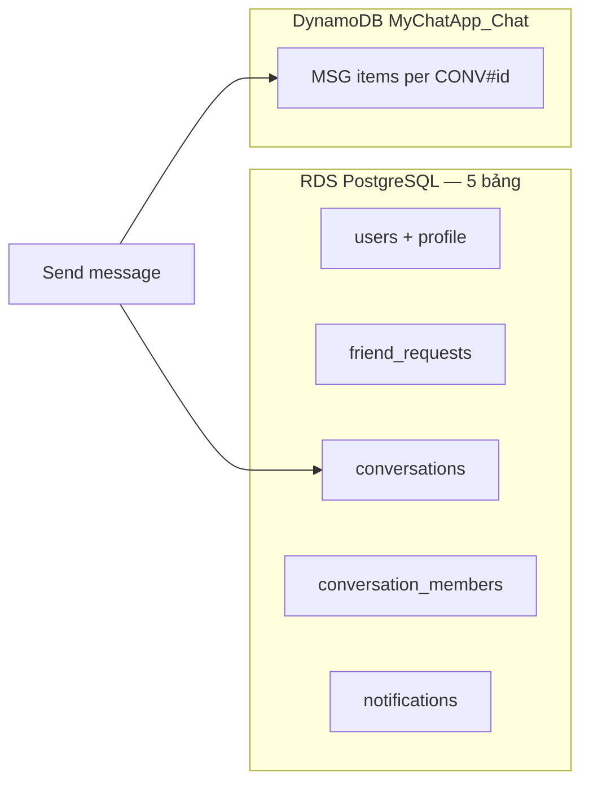
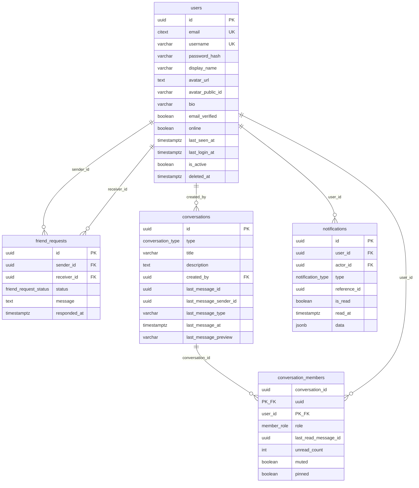
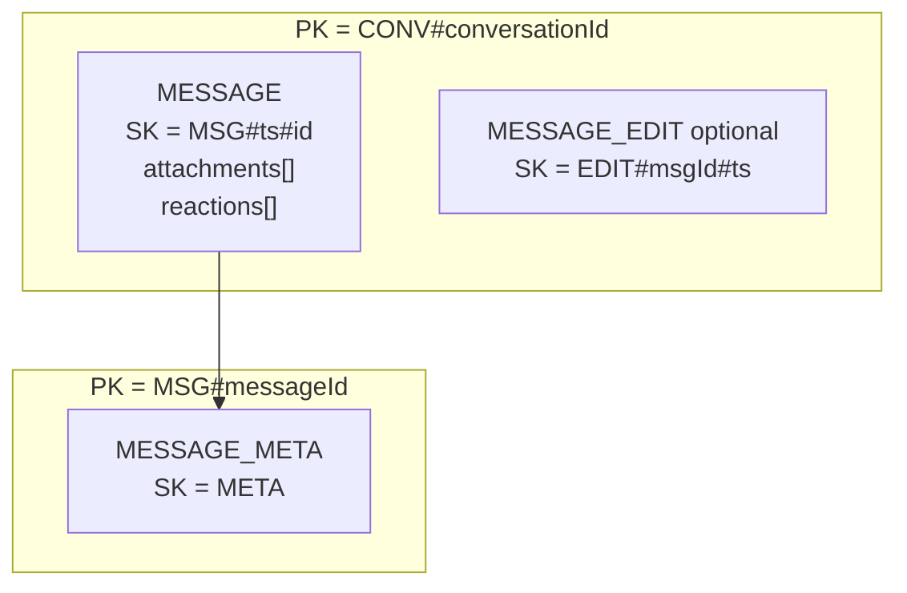
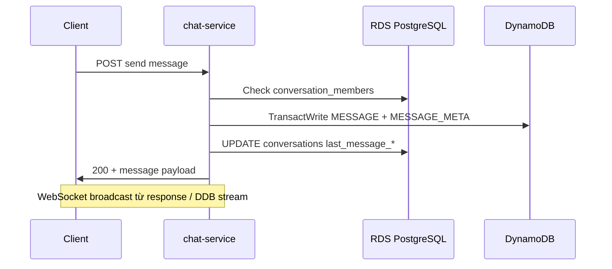

# Thiết kế database — Polyglot Persistence (AWS)

Tài liệu thiết kế **mục tiêu** cho MyChatApp: dữ liệu quan hệ trên **Amazon RDS for PostgreSQL** (**5 bảng** — biến thể gọn), tin nhắn chat trên **Amazon DynamoDB** (single-table).  
Ánh xạ từ domain hiện tại (`db.md` / entity Java), không phải trạng thái triển khai hiện tại.

---

## 1. Tổng quan kiến trúc

| Thành phần | Công nghệ AWS | Dữ liệu |
|------------|---------------|---------|
| Identity & profile | RDS PostgreSQL | `users` *(đã gộp profile)* |
| Quan hệ bạn bè | RDS PostgreSQL | `friend_requests` *(ACCEPTED = đã là bạn, không bảng `friendships`)* |
| Metadata phòng chat | RDS PostgreSQL | `conversations`, `conversation_members` |
| Thông báo in-app | RDS PostgreSQL | `notifications` |
| Timeline tin nhắn | DynamoDB (single table) | `MESSAGE` *(embed `attachments`, `reactions`)*, `MESSAGE_META` |
| Email | Không persist (SMTP / SES) | — |

**Mô hình:** Polyglot persistence — **không** CQRS. Chỉ một điểm “chạm” hai store: khi **gửi tin** (ghi DynamoDB + cập nhật `conversations.last_message_*` trên PostgreSQL).



**Khóa nối giữa hai store:** `conversation_id` (UUID) và `message_id` (UUID/ULID) — sinh ở application, PostgreSQL giữ metadata, DynamoDB giữ nội dung tin.

---

## 2. Amazon RDS — PostgreSQL

### 2.0. Biến thể gọn — 5 bảng (giảm từ 7)

| # | Bảng | Thay đổi so với bản 7 bảng |
|---|------|---------------------------|
| 1 | `users` | Gộp `user_profiles` (auth + display name, avatar, online, …) |
| 2 | `friend_requests` | `status = ACCEPTED` thay cho bảng `friendships` |
| 3 | `conversations` | Giữ nguyên |
| 4 | `conversation_members` | Giữ tách — quan hệ N–N, không gộp JSONB |
| 5 | `notifications` | Giữ riêng |

**Đã bỏ:** `user_profiles`, `friendships`.

> **Ghi chú:** Nếu đếm theo 4 nhóm nghiệp vụ (identity, social, chat meta, notify) thì chat meta gồm 2 bảng (`conversations` + `conversation_members`) — tổng **5 bảng vật lý** trên RDS.

### 2.1. Khuyến nghị vận hành RDS

| Hạng mục | Gợi ý |
|----------|--------|
| Engine | PostgreSQL 15+ hoặc 16 |
| DB identifier | `mychatapp-prod` |
| Database name | `mychatapp` |
| Schema | `app` (tránh dùng `public` cho app logic) |
| PK | `UUID` — `gen_random_uuid()` (PG 13+) hoặc UUID v7 từ app |
| Timezone | `TIMESTAMPTZ` UTC |
| Extension | `pgcrypto` (nếu dùng `gen_random_uuid()`), tùy chọn `citext` cho email |
| Connection | RDS Proxy khi nhiều instance Spring Boot |
| Secret | AWS Secrets Manager → Spring `spring.datasource.url` |

### 2.2. ENUM types

```sql
CREATE SCHEMA IF NOT EXISTS app;

CREATE TYPE app.friend_request_status AS ENUM ('PENDING', 'ACCEPTED', 'REJECTED');
CREATE TYPE app.conversation_type AS ENUM ('PRIVATE', 'GROUP');
CREATE TYPE app.member_role AS ENUM ('OWNER', 'MEMBER');
CREATE TYPE app.notification_type AS ENUM (
  'FRIEND_REQUEST',
  'FRIEND_ACCEPTED',
  'MESSAGE',
  'SYSTEM'
);
```

### 2.3. Bảng & quan hệ



### 2.4. DDL (PostgreSQL)

```sql
-- ========== USERS (gộp user_profiles) ==========
CREATE TABLE app.users (
    id                  UUID PRIMARY KEY DEFAULT gen_random_uuid(),
    -- Auth
    email               CITEXT NOT NULL,
    username            VARCHAR(50) NOT NULL,
    password_hash       VARCHAR(255) NOT NULL,
    email_verified      BOOLEAN NOT NULL DEFAULT FALSE,
    -- Profile
    display_name        VARCHAR(100) NOT NULL,
    avatar_url          TEXT,
    avatar_public_id    VARCHAR(255),          -- S3 object key (xóa/replace ảnh)
    bio                 VARCHAR(500),
    phone               VARCHAR(20),
    locale              VARCHAR(10) NOT NULL DEFAULT 'vi',
    -- Presence
    online              BOOLEAN NOT NULL DEFAULT FALSE,
    last_seen_at        TIMESTAMPTZ,
    last_login_at       TIMESTAMPTZ,
    -- Account lifecycle
    is_active           BOOLEAN NOT NULL DEFAULT TRUE,
    deleted_at          TIMESTAMPTZ,             -- soft delete; NULL = còn hoạt động
    password_changed_at TIMESTAMPTZ,
    created_at          TIMESTAMPTZ NOT NULL DEFAULT NOW(),
    updated_at          TIMESTAMPTZ NOT NULL DEFAULT NOW(),

    CONSTRAINT uq_users_email UNIQUE (email),
    CONSTRAINT uq_users_username UNIQUE (username),
    CONSTRAINT chk_users_email_format CHECK (email ~* '^[^@]+@[^@]+\.[^@]+$'),
    CONSTRAINT chk_users_soft_delete CHECK (
        deleted_at IS NULL OR is_active = FALSE
    )
);

CREATE INDEX idx_users_display_name ON app.users (display_name);
CREATE INDEX idx_users_online ON app.users (online) WHERE deleted_at IS NULL;
CREATE INDEX idx_users_email_active ON app.users (email) WHERE deleted_at IS NULL;

CREATE UNIQUE INDEX uq_users_phone
    ON app.users (phone)
    WHERE phone IS NOT NULL AND deleted_at IS NULL;

-- ========== FRIEND (một bảng — ACCEPTED = đã là bạn) ==========
CREATE TABLE app.friend_requests (
    id              UUID PRIMARY KEY DEFAULT gen_random_uuid(),
    sender_id       UUID NOT NULL REFERENCES app.users(id) ON DELETE CASCADE,
    receiver_id     UUID NOT NULL REFERENCES app.users(id) ON DELETE CASCADE,
    status          app.friend_request_status NOT NULL DEFAULT 'PENDING',
    message         TEXT,                      -- lời nhắn kèm lời mời (optional)
    responded_at    TIMESTAMPTZ,                 -- thời điểm ACCEPT / REJECT
    created_at      TIMESTAMPTZ NOT NULL DEFAULT NOW(),
    updated_at      TIMESTAMPTZ NOT NULL DEFAULT NOW(),

    CONSTRAINT chk_friend_requests_not_self CHECK (sender_id <> receiver_id),
    CONSTRAINT chk_friend_requests_responded CHECK (
        (status = 'PENDING' AND responded_at IS NULL)
        OR (status IN ('ACCEPTED', 'REJECTED') AND responded_at IS NOT NULL)
    )
);

-- Chỉ một lời mời PENDING cho cặp (sender, receiver)
CREATE UNIQUE INDEX uq_friend_requests_pending_pair
    ON app.friend_requests (sender_id, receiver_id)
    WHERE status = 'PENDING';

-- Tối đa một quan hệ ACCEPTED cho cặp (không phân biệt ai là sender)
CREATE UNIQUE INDEX uq_friend_requests_accepted_pair
    ON app.friend_requests (
        LEAST(sender_id, receiver_id),
        GREATEST(sender_id, receiver_id)
    )
    WHERE status = 'ACCEPTED';

CREATE INDEX idx_friend_requests_receiver_status
    ON app.friend_requests (receiver_id, status);

CREATE INDEX idx_friend_requests_sender_status
    ON app.friend_requests (sender_id, status);

-- ========== CONVERSATION (metadata — không lưu nội dung tin) ==========
CREATE TABLE app.conversations (
    id                      UUID PRIMARY KEY DEFAULT gen_random_uuid(),
    type                    app.conversation_type NOT NULL,
    title                   VARCHAR(255),          -- GROUP: tên nhóm; PRIVATE: có thể NULL
    description             TEXT,                  -- GROUP: mô tả
    avatar_url              TEXT,
    created_by              UUID NOT NULL REFERENCES app.users(id),
    -- Denormalized từ DynamoDB (cập nhật khi gửi tin)
    last_message_id         UUID,                  -- id tin DynamoDB
    last_message_sender_id  UUID REFERENCES app.users(id),
    last_message_type       VARCHAR(10),           -- TEXT | FILE (đồng bộ MESSAGE.type DynamoDB)
    last_message_at         TIMESTAMPTZ,
    last_message_preview    VARCHAR(500),          -- snippet inbox
    -- Lifecycle
    deleted                 BOOLEAN NOT NULL DEFAULT FALSE,
    deleted_at              TIMESTAMPTZ,
    created_at              TIMESTAMPTZ NOT NULL DEFAULT NOW(),
    updated_at              TIMESTAMPTZ NOT NULL DEFAULT NOW(),

    CONSTRAINT chk_conversations_group_title CHECK (
        type <> 'GROUP' OR (title IS NOT NULL AND LENGTH(TRIM(title)) > 0)
    ),
    CONSTRAINT chk_conversations_last_message_type CHECK (
        last_message_type IS NULL
        OR last_message_type IN ('TEXT', 'FILE')
    )
);

CREATE INDEX idx_conversations_last_message_at
    ON app.conversations (last_message_at DESC NULLS LAST)
    WHERE deleted = FALSE;

CREATE INDEX idx_conversations_created_by
    ON app.conversations (created_by)
    WHERE deleted = FALSE;

CREATE INDEX idx_conversations_type
    ON app.conversations (type)
    WHERE deleted = FALSE;

CREATE TABLE app.conversation_members (
    conversation_id         UUID NOT NULL REFERENCES app.conversations(id) ON DELETE CASCADE,
    user_id                 UUID NOT NULL REFERENCES app.users(id) ON DELETE CASCADE,
    role                      app.member_role NOT NULL DEFAULT 'MEMBER',
    nickname                  VARCHAR(100),       -- tên hiển thị trong phòng (GROUP)
    invited_by                UUID REFERENCES app.users(id),
    -- Read state (đối chiếu message id trên DynamoDB)
    last_read_message_id      UUID,
    last_read_at              TIMESTAMPTZ,
    unread_count              INTEGER NOT NULL DEFAULT 0 CHECK (unread_count >= 0),
    -- Per-user UI preferences
    muted                     BOOLEAN NOT NULL DEFAULT FALSE,
    pinned                    BOOLEAN NOT NULL DEFAULT FALSE,
    notifications_enabled     BOOLEAN NOT NULL DEFAULT TRUE,
    archived                  BOOLEAN NOT NULL DEFAULT FALSE,
    deleted                   BOOLEAN NOT NULL DEFAULT FALSE,  -- rời nhóm / ẩn phòng
    left_at                   TIMESTAMPTZ,                   -- khi rời GROUP
    joined_at                 TIMESTAMPTZ NOT NULL DEFAULT NOW(),
    updated_at                TIMESTAMPTZ NOT NULL DEFAULT NOW(),

    PRIMARY KEY (conversation_id, user_id),
    CONSTRAINT chk_conversation_members_left CHECK (
        (deleted = FALSE AND left_at IS NULL)
        OR (deleted = TRUE AND left_at IS NOT NULL)
    )
);

CREATE INDEX idx_conversation_members_user_id
    ON app.conversation_members (user_id)
    WHERE deleted = FALSE AND archived = FALSE;

CREATE INDEX idx_conversation_members_user_pinned
    ON app.conversation_members (user_id, pinned DESC, updated_at DESC)
    WHERE deleted = FALSE AND archived = FALSE;

-- Tìm phòng PRIVATE đã tồn tại giữa 2 user (thay Mongo $all query)
CREATE INDEX idx_conversation_members_conversation
    ON app.conversation_members (conversation_id, user_id);

-- ========== NOTIFICATIONS ==========
CREATE TABLE app.notifications (
    id              UUID PRIMARY KEY DEFAULT gen_random_uuid(),
    user_id         UUID NOT NULL REFERENCES app.users(id) ON DELETE CASCADE,  -- người nhận
    actor_id        UUID REFERENCES app.users(id) ON DELETE SET NULL,         -- người gây ra (gửi lời mời, gửi tin, …)
    type            app.notification_type NOT NULL,
    title           VARCHAR(255) NOT NULL,
    body            TEXT NOT NULL,
    reference_id    UUID,                        -- friend_request.id, conversation.id, message.id, …
    data            JSONB NOT NULL DEFAULT '{}',  -- payload mở rộng: senderName, conversationId, …
    is_read         BOOLEAN NOT NULL DEFAULT FALSE,
    read_at         TIMESTAMPTZ,
    deleted         BOOLEAN NOT NULL DEFAULT FALSE,
    created_at      TIMESTAMPTZ NOT NULL DEFAULT NOW(),
    expire_at       TIMESTAMPTZ NOT NULL DEFAULT (NOW() + INTERVAL '30 days'),

    CONSTRAINT chk_notifications_read_consistency CHECK (
        (is_read = FALSE AND read_at IS NULL)
        OR (is_read = TRUE AND read_at IS NOT NULL)
    )
);

CREATE INDEX idx_notifications_user_created
    ON app.notifications (user_id, created_at DESC)
    WHERE deleted = FALSE;

CREATE INDEX idx_notifications_user_unread
    ON app.notifications (user_id, created_at DESC)
    WHERE is_read = FALSE AND deleted = FALSE;

CREATE INDEX idx_notifications_reference
    ON app.notifications (type, reference_id);

CREATE INDEX idx_notifications_data_gin
    ON app.notifications USING gin (data);

-- ========== TRIGGER updated_at (optional) ==========
CREATE OR REPLACE FUNCTION app.set_updated_at()
RETURNS TRIGGER AS $$
BEGIN
    NEW.updated_at = NOW();
    RETURN NEW;
END;
$$ LANGUAGE plpgsql;

CREATE TRIGGER trg_users_updated_at
    BEFORE UPDATE ON app.users
    FOR EACH ROW EXECUTE FUNCTION app.set_updated_at();

CREATE TRIGGER trg_friend_requests_updated_at
    BEFORE UPDATE ON app.friend_requests
    FOR EACH ROW EXECUTE FUNCTION app.set_updated_at();

CREATE TRIGGER trg_conversations_updated_at
    BEFORE UPDATE ON app.conversations
    FOR EACH ROW EXECUTE FUNCTION app.set_updated_at();

CREATE TRIGGER trg_conversation_members_updated_at
    BEFORE UPDATE ON app.conversation_members
    FOR EACH ROW EXECUTE FUNCTION app.set_updated_at();
```

### 2.4.1. Tổng hợp trường theo bảng

#### `app.users`

| Nhóm | Trường | Mục đích |
|------|--------|----------|
| Auth | `email`, `username`, `password_hash`, `email_verified` | Đăng nhập, xác thực email sau này |
| Profile | `display_name`, `avatar_url`, `avatar_public_id`, `bio`, `phone`, `locale` | Hiển thị, S3 avatar key, i18n |
| Presence | `online`, `last_seen_at`, `last_login_at` | Trạng thái realtime / audit login |
| Lifecycle | `is_active`, `deleted_at`, `password_changed_at`, `created_at`, `updated_at` | Soft delete, đổi mật khẩu |

#### `app.friend_requests`

| Trường | Mục đích |
|--------|----------|
| `message` | Lời nhắn kèm lời mời kết bạn |
| `responded_at` | Thời điểm chấp nhận / từ chối (`friends_since` ≈ `responded_at` khi ACCEPT) |
| `status` | `PENDING` / `ACCEPTED` / `REJECTED` — thay bảng `friendships` |

#### `app.conversations`

| Trường | Mục đích |
|--------|----------|
| `description` | Mô tả nhóm GROUP |
| `last_message_sender_id`, `last_message_type` | Inbox: `TEXT` hoặc `FILE` (khớp `MESSAGE.type`) |
| `last_message_preview`, `last_message_at`, `last_message_id` | Sort danh sách phòng, đồng bộ từ DynamoDB |
| `deleted`, `deleted_at` | Soft delete phòng |

#### `app.conversation_members`

| Trường | Mục đích |
|--------|----------|
| `invited_by` | Ai mời vào GROUP |
| `unread_count` | Badge chưa đọc (cập nhật khi gửi/đọc tin) |
| `muted`, `notifications_enabled` | Tắt tiếng / tắt push phòng |
| `pinned` | Ghim phòng trên inbox |
| `left_at`, `deleted` | Rời nhóm / ẩn phòng phía user |
| `last_read_message_id`, `last_read_at` | Đối chiếu DynamoDB, tính unread |

#### `app.notifications`

| Trường | Mục đích |
|--------|----------|
| `actor_id` | User gây ra thông báo (thay `senderName` trong event) |
| `data` (JSONB) | `conversationId`, `senderName`, deeplink, … linh hoạt |
| `read_at` | Thời điểm đọc (kèm `is_read`) |
| `expire_at` | TTL 30 ngày (cron hoặc pg job xóa) |
| `deleted` | Ẩn thông báo phía client |

### 2.5. Ràng buộc nghiệp vụ (application + SQL)

| Nghiệp vụ | PostgreSQL |
|-----------|------------|
| Đăng ký | Một `INSERT users` (email, username, password_hash, display_name = username, avatar_url mặc định) |
| Gửi lời mời | `INSERT friend_requests` status `PENDING` |
| Chấp nhận | `UPDATE friend_requests SET status = 'ACCEPTED', responded_at = NOW()` → `INSERT conversations` + 2 `conversation_members` (1 transaction) |
| Từ chối lời mời | `UPDATE status = 'REJECTED', responded_at = NOW()` |
| Đánh dấu đã đọc TB | `UPDATE notifications SET is_read = TRUE, read_at = NOW()` |
| Danh sách bạn | `friend_requests` WHERE `status = 'ACCEPTED'` AND (`sender_id` = :me OR `receiver_id` = :me) |
| Danh sách phòng | `JOIN conversation_members` + `conversations` `ORDER BY last_message_at DESC` |
| Gửi tin | **Không** insert message vào PG — chỉ `UPDATE conversations` sau khi ghi DynamoDB |

**Danh sách bạn bè (không cần bảng `friendships`):**

```sql
SELECT fr.id, fr.sender_id, fr.receiver_id, fr.responded_at AS friends_since
FROM app.friend_requests fr
WHERE fr.status = 'ACCEPTED'
  AND (:me = fr.sender_id OR :me = fr.receiver_id);
```

**Tìm conversation PRIVATE giữa user U1, U2:**

```sql
SELECT c.id
FROM app.conversations c
JOIN app.conversation_members m1 ON m1.conversation_id = c.id AND m1.user_id = :u1
JOIN app.conversation_members m2 ON m2.conversation_id = c.id AND m2.user_id = :u2
WHERE c.type = 'PRIVATE' AND c.deleted = FALSE
LIMIT 1;
```

### 2.6. Đồng bộ chéo RDS ↔ DynamoDB (chỉ khi gửi tin)

```
1. Validate membership (PostgreSQL)
2. PutItem MESSAGE → DynamoDB (source of truth)
3. UPDATE app.conversations
     SET last_message_id = :msgId,
         last_message_sender_id = :senderId,
         last_message_type = :type,
         last_message_at = :ts,
         last_message_preview = :preview
         -- TEXT: LEFT(content, 500)
         -- FILE: f(attachments[0].fileType, fileName) VD: '[Ảnh] photo.jpg',
         updated_at = NOW()
   WHERE id = :conversationId
4. (Tuỳ chọn) UPDATE app.conversation_members
     SET unread_count = unread_count + 1, updated_at = NOW()
   WHERE conversation_id = :conversationId AND user_id <> :senderId AND deleted = FALSE
```

- Nếu bước 3–4 fail: tin vẫn trong DynamoDB — retry hoặc reconciliation job.
- `last_message_id` **không** là FK — chỉ tham chiếu logic tới message id DynamoDB.
- Khi user **đọc tin**: cập nhật `last_read_message_id`, `last_read_at`, reset `unread_count = 0` trên `conversation_members`.

---

## 3. Amazon DynamoDB — Single-table design

### 3.1. Bảng vật lý

| Thuộc tính | Giá trị |
|------------|--------|
| **Table name** | `MyChatApp_Chat` |
| **Billing** | On-demand (dev) / Provisioned + auto scaling (prod) |
| **Partition key (PK)** | `PK` (String) |
| **Sort key (SK)** | `SK` (String) |
| **TTL attribute** | `ttl` (Number, epoch seconds) — tin/attachment đã xóa mềm |
| **Streams** | Bật nếu cần async projection / audit / đồng bộ SQL |

**Phạm vi single-table:** Chỉ domain **chat timeline** (tin nhắn và thực thể con). Metadata phòng (`conversations`, members) nằm trên **PostgreSQL**.

### 3.2. Các thực thể (entity types) — **embed trong MESSAGE**

| `entityType` | Mô tả | Map từ Mongo |
|--------------|--------|--------------|
| `MESSAGE` | Tin nhắn + **`attachments[]`** + **`reactions[]`** embed | `messages`, `message_attachments`, `message_reactions` |
| `MESSAGE_META` | Tra cứu O(1) theo `messageId` | *(mới)* |
| `MESSAGE_EDIT` | *(optional)* Lịch sử sửa nội dung | *(mới)* |

**Quyết định thiết kế:** Không tạo item DynamoDB riêng cho `ATTACHMENT` / `REACTION`. Mọi file đính kèm và reaction nằm trong **một item `MESSAGE`** — đơn giản query timeline, một lần đọc đủ dữ liệu hiển thị.



| Thành phần | Lưu ở đâu |
|------------|-----------|
| File binary | **S3** — DynamoDB chỉ metadata trong `attachments[]` |
| Attachment metadata | `MESSAGE.attachments` (List of Map) |
| Reaction | `MESSAGE.reactions` (List of Map) |
| Chỉnh sửa tin | `edited`, `editedAt` trên `MESSAGE`; audit → `MESSAGE_EDIT` (tùy chọn) |

### 3.3. Quy ước khóa (PK / SK)

| Entity | PK | SK | Ghi chú |
|--------|----|----|---------|
| **MESSAGE** | `CONV#<conversationId>` | `MSG#<createdAtIso>#<messageId>` | Chứa embed `attachments`, `reactions` |
| **MESSAGE_META** | `MSG#<messageId>` | `META` | Trỏ về `timelinePk` / `timelineSk` |
| **MESSAGE_EDIT** *(optional)* | `CONV#<conversationId>` | `EDIT#<messageId>#<editedAtIso>` | Audit sửa nội dung |

Quy ước chung:

- `createdAtIso`: ISO-8601 UTC fixed-width, ví dụ `2025-05-22T14:30:00.123Z` — sort SK = sort thời gian.
- `messageId`, `attachmentId`: UUID v7 / ULID từ application.
- `conversationId`: UUID trùng `app.conversations.id` (PostgreSQL).

### 3.4. Access patterns

| # | Access pattern | Operation | Key / GSI |
|---|----------------|-----------|-----------|
| AP1 | Lịch sử tin trong phòng | Query | `PK=CONV#id`, `SK begins_with MSG#` |
| AP2a | Gửi tin TEXT | TransactWrite | `type=TEXT`, `attachments=[]` |
| AP2b | Gửi tin FILE | TransactWrite | `type=FILE`, `attachments[]` ≥ 1 (mỗi item có `fileType`) |
| AP3 | Lấy tin theo id | GetItem | `MSG#id` / `META` → GetItem timeline (đủ attach + react) |
| AP4 | Reply | AP3 → AP2 với `replyToMessageId`, `replyToPreview` |
| AP5 | Sửa nội dung tin | UpdateItem | Cập nhật `content`, `edited`, `editedAt` trên `MESSAGE` + META |
| AP6 | Xóa mềm tin | UpdateItem | `deleted=true`, `deletedAt`, `ttl` |
| AP7 | Thêm / đổi / xóa reaction | UpdateItem | Đọc `MESSAGE` → sửa list `reactions` → ghi lại (§3.5.5) |
| AP8 | Thêm attachment sau gửi | UpdateItem | Append vào `attachments[]`, tăng `attachmentCount` |
| AP9 | Lịch sử chỉnh sửa *(optional)* | Query | `SK begins_with EDIT#msgId#` |

**Không** dùng DynamoDB để: list phòng chat, danh sách bạn, profile user → **PostgreSQL**.

### 3.5. Schema từng thực thể

#### 3.5.1. `MESSAGE` (timeline)

`PK = CONV#<conversationId>`, `SK = MSG#<createdAtIso>#<messageId>`

| Attribute | Kiểu | Bắt buộc | Mô tả |
|-----------|------|----------|--------|
| `entityType` | S | ✓ | `MESSAGE` |
| `messageId` | S | ✓ | UUID |
| `conversationId` | S | ✓ | UUID PostgreSQL |
| `senderId` | S | ✓ | UUID user |
| `type` | S | ✓ | **`TEXT`** \| **`FILE`** — chỉ hai loại tin |
| `content` | S | | `TEXT`: bắt buộc nội dung; `FILE`: caption tùy chọn |
| `replyToMessageId` | S | | Tin được trả lời |
| `replyToPreview` | S | | Snippet tin gốc (denormalize, optional) |
| `edited` | BOOL | ✓ | default `false` |
| `deleted` | BOOL | ✓ | default `false` |
| `editedAt` | S | | ISO-8601 |
| `deletedAt` | S | | ISO-8601 |
| `createdAt` | S | ✓ | Trùng phần thời gian trong SK |
| `attachmentCount` | N | ✓ | `size(attachments)` — denormalize cho inbox/preview |
| `reactionCount` | N | ✓ | `size(reactions)` — badge UI |
| `attachments` | L&lt;M&gt; | ✓ | **Embed** — §3.5.3 *(chỉ khi `type=FILE`)* |
| `reactions` | L&lt;M&gt; | ✓ | **Embed** — §3.5.4 |
| `ttl` | N | | Epoch giây; xóa vật lý sau 90 ngày nếu `deleted=true` |
| `version` | N | | Optimistic lock (optional) |

#### 3.5.2. Quy tắc `MESSAGE.type` = `TEXT` | `FILE`

| `MESSAGE.type` | `content` | `attachments[]` | `last_message_preview` (SQL) |
|----------------|-----------|-----------------|------------------------------|
| **TEXT** | Bắt buộc, không rỗng | `[]` (rỗng) | Nội dung text (truncate 500) |
| **FILE** | Tùy chọn (caption) | ≥ 1 phần tử | VD: `[Ảnh] tên.jpg` / `[Video] …` theo `fileType` |

- Không dùng `IMAGE` / `VIDEO` ở cấp **message** — loại cụ thể nằm trong từng **attachment**.
- `last_message_type` trên PostgreSQL chỉ mirror `TEXT` hoặc `FILE`.

#### 3.5.3. Embed `attachments[]` (chỉ khi `type = FILE`)

Mỗi phần tử trong list `attachments` (Map):

| Field | Kiểu | Bắt buộc | Mô tả |
|-------|------|----------|--------|
| `attachmentId` | S | ✓ | UUID |
| `fileType` | S | ✓ | Loại file **cụ thể**: `IMAGE` \| `VIDEO` \| `AUDIO` \| `DOCUMENT` \| `OTHER` |
| `mimeType` | S | ✓ | MIME chuẩn: `image/jpeg`, `video/mp4`, `application/pdf`, … |
| `url` | S | ✓ | CDN / presigned S3 |
| `s3Key` | S | ✓ | Object key S3 |
| `fileName` | S | ✓ | Tên file gốc |
| `size` | N | | Bytes |
| `width` | N | | `fileType = IMAGE` \| `VIDEO` |
| `height` | N | | `fileType = IMAGE` \| `VIDEO` |
| `duration` | N | | Giây — `fileType = VIDEO` \| `AUDIO` |
| `thumbnailUrl` | S | | Preview — thường `IMAGE` / `VIDEO` |

**Gợi ý map `mimeType` → `fileType` (application layer):**

| Prefix / MIME | `fileType` |
|---------------|------------|
| `image/*` | `IMAGE` |
| `video/*` | `VIDEO` |
| `audio/*` | `AUDIO` |
| `application/pdf`, `application/msword`, … | `DOCUMENT` |
| Còn lại | `OTHER` |

**Luồng gửi FILE:** upload S3 từng file → suy ra `fileType` + `mimeType` → build `attachments[]` → Put `MESSAGE` với `type: FILE`.

**Giới hạn:** tổng item DynamoDB ≤ 400 KB; không nhúng binary; thumbnail chỉ URL.

#### 3.5.4. Embed `reactions[]`

Mỗi phần tử trong list `reactions` (Map):

| Field | Kiểu | Bắt buộc | Mô tả |
|-------|------|----------|--------|
| `userId` | S | ✓ | UUID — mỗi user tối đa **một** phần tử trong list |
| `reactionType` | S | ✓ | `LIKE`, `LOVE`, `HAHA`, `WOW`, `SAD`, `ANGRY` |
| `createdAt` | S | ✓ | ISO-8601 lần react đầu |
| `updatedAt` | S | | ISO-8601 khi đổi loại reaction |

**Ràng buộc nghiệp vụ:** 1 user = 1 reaction / message (đổi type = cập nhật phần tử cũ, không thêm dòng mới).

#### 3.5.5. Cập nhật reaction (AP7) — embed

```
1. GetItem MESSAGE (timelinePk, timelineSk từ META)
2. Tìm phần tử reactions where userId = :me
   - Có + cùng reactionType → no-op hoặc Delete (bỏ react)
   - Có + khác type → cập nhật reactionType, updatedAt
   - Không có → append { userId, reactionType, createdAt }
3. Set reactionCount = size(reactions)
4. UpdateItem MESSAGE (+ condition version nếu dùng optimistic lock)
5. (Tuỳ chọn) WebSocket broadcast reaction summary tới /topic/conversation/{id}
```

**Xử lý ghi đồng thời:** Dùng `version` trên `MESSAGE` + `ConditionExpression version = :expected` hoặc retry read-modify-write (đủ cho đồ án).

---

#### 3.5.6. `MESSAGE_META` (lookup index)

`PK = MSG#<messageId>`, `SK = META`

| Attribute | Kiểu | Mô tả |
|-----------|------|--------|
| `entityType` | S | `MESSAGE_META` |
| `messageId` | S | |
| `conversationId` | S | Validate membership trước khi sửa/xóa |
| `senderId` | S | |
| `type` | S | |
| `timelinePk` | S | `CONV#...` |
| `timelineSk` | S | `MSG#...` — trỏ item timeline |
| `deleted` | BOOL | Mirror từ MESSAGE |
| `createdAt` | S | |

---

#### 3.5.7. `MESSAGE_EDIT` (optional — audit)

`PK = CONV#<conversationId>`, `SK = EDIT#<messageId>#<editedAtIso>`

| Attribute | Kiểu | Mô tả |
|-----------|------|--------|
| `entityType` | S | `MESSAGE_EDIT` |
| `messageId` | S | |
| `conversationId` | S | |
| `editorId` | S | Thường = `senderId` |
| `previousContent` | S | Nội dung trước khi sửa |
| `newContent` | S | |
| `editedAt` | S | |

### 3.6. TransactWrite — gửi tin (AP2)

```
TransactWriteItems:
  1. Put MESSAGE      — gồm attachments[] (nếu có), reactions: []
  2. Put MESSAGE_META
```

Sau transaction thành công → cập nhật PostgreSQL `conversations.last_message_*` (§2.6).

### 3.7. Ví dụ item (JSON)

**MESSAGE (TEXT):**

```json
{
  "PK": "CONV#a1b2c3d4-e5f6-7890-abcd-ef1234567890",
  "SK": "MSG#2025-05-22T14:30:00.123Z#019302ab-cdef-7890-1234-567890abcdef",
  "entityType": "MESSAGE",
  "messageId": "019302ab-cdef-7890-1234-567890abcdef",
  "conversationId": "a1b2c3d4-e5f6-7890-abcd-ef1234567890",
  "senderId": "user-uuid-sender",
  "type": "TEXT",
  "content": "Xin chào!",
  "replyToMessageId": null,
  "replyToPreview": null,
  "edited": false,
  "deleted": false,
  "createdAt": "2025-05-22T14:30:00.123Z",
  "attachmentCount": 0,
  "reactionCount": 0,
  "attachments": [],
  "reactions": []
}
```

**MESSAGE (FILE — ảnh, `fileType` cụ thể trên attachment):**

```json
{
  "PK": "CONV#a1b2c3d4-e5f6-7890-abcd-ef1234567890",
  "SK": "MSG#2025-05-22T14:31:00.000Z#019302ab-aaaa-bbbb-cccc-ddddeeeeffff",
  "entityType": "MESSAGE",
  "messageId": "019302ab-aaaa-bbbb-cccc-ddddeeeeffff",
  "conversationId": "a1b2c3d4-e5f6-7890-abcd-ef1234567890",
  "senderId": "user-uuid-sender",
  "type": "FILE",
  "content": "Ảnh chụp nhóm",
  "attachmentCount": 1,
  "attachments": [
    {
      "attachmentId": "att-uuid-1",
      "fileType": "IMAGE",
      "mimeType": "image/jpeg",
      "url": "https://cdn.example.com/photo.jpg",
      "s3Key": "chat/conv-id/att-uuid-1.jpg",
      "fileName": "photo.jpg",
      "size": 204800,
      "width": 1280,
      "height": 720,
      "thumbnailUrl": "https://cdn.example.com/photo-thumb.jpg"
    }
  ],
  "reactionCount": 0,
  "reactions": [],
  "createdAt": "2025-05-22T14:31:00.000Z",
  "edited": false,
  "deleted": false
}
```

**MESSAGE (FILE — nhiều loại file trong một tin):**

```json
{
  "type": "FILE",
  "content": "",
  "attachmentCount": 2,
  "attachments": [
    {
      "attachmentId": "att-1",
      "fileType": "VIDEO",
      "mimeType": "video/mp4",
      "fileName": "clip.mp4",
      "url": "https://cdn.example.com/clip.mp4",
      "s3Key": "chat/conv/clip.mp4",
      "duration": 120,
      "size": 5242880
    },
    {
      "attachmentId": "att-2",
      "fileType": "DOCUMENT",
      "mimeType": "application/pdf",
      "fileName": "report.pdf",
      "url": "https://cdn.example.com/report.pdf",
      "s3Key": "chat/conv/report.pdf",
      "size": 102400
    }
  ]
}
```

**MESSAGE_META:**

```json
{
  "PK": "MSG#019302ab-cdef-7890-1234-567890abcdef",
  "SK": "META",
  "entityType": "MESSAGE_META",
  "messageId": "019302ab-cdef-7890-1234-567890abcdef",
  "conversationId": "a1b2c3d4-e5f6-7890-abcd-ef1234567890",
  "senderId": "user-uuid-sender",
  "type": "TEXT",
  "timelinePk": "CONV#a1b2c3d4-e5f6-7890-abcd-ef1234567890",
  "timelineSk": "MSG#2025-05-22T14:30:00.123Z#019302ab-cdef-7890-1234-567890abcdef",
  "deleted": false,
  "createdAt": "2025-05-22T14:30:00.123Z"
}
```

**MESSAGE (có reactions embed):**

```json
{
  "PK": "CONV#a1b2c3d4-e5f6-7890-abcd-ef1234567890",
  "SK": "MSG#2025-05-22T14:30:00.123Z#019302ab-cdef-7890-1234-567890abcdef",
  "entityType": "MESSAGE",
  "messageId": "019302ab-cdef-7890-1234-567890abcdef",
  "conversationId": "a1b2c3d4-e5f6-7890-abcd-ef1234567890",
  "senderId": "user-uuid-sender",
  "type": "TEXT",
  "content": "Xin chào!",
  "attachmentCount": 0,
  "reactionCount": 2,
  "attachments": [],
  "reactions": [
    {
      "userId": "user-uuid-a",
      "reactionType": "LOVE",
      "createdAt": "2025-05-22T14:35:00.000Z"
    },
    {
      "userId": "user-uuid-b",
      "reactionType": "HAHA",
      "createdAt": "2025-05-22T14:36:00.000Z",
      "updatedAt": "2025-05-22T14:36:00.000Z"
    }
  ],
  "edited": false,
  "deleted": false,
  "createdAt": "2025-05-22T14:30:00.123Z",
  "version": 3
}
```

**MESSAGE_EDIT** *(optional)*:

```json
{
  "PK": "CONV#a1b2c3d4-e5f6-7890-abcd-ef1234567890",
  "SK": "EDIT#019302ab-cdef-7890-1234-567890abcdef#2025-05-22T15:00:00.000Z",
  "entityType": "MESSAGE_EDIT",
  "messageId": "019302ab-cdef-7890-1234-567890abcdef",
  "conversationId": "a1b2c3d4-e5f6-7890-abcd-ef1234567890",
  "editorId": "user-uuid-sender",
  "previousContent": "Xin chào!",
  "newContent": "Xin chào mọi người!",
  "editedAt": "2025-05-22T15:00:00.000Z"
}
```

### 3.8. Global Secondary Index (tùy chọn)

Chỉ thêm khi có access pattern thật — mỗi GSI tốn chi phí ghi.

| GSI | PK (GSI) | SK (GSI) | Entity | Dùng cho |
|-----|----------|----------|--------|----------|
| `GSI1-SenderTimeline` | `SENDER#<userId>` | `TS#<createdAt>#MSG#<id>` | MESSAGE | Moderation / export tin theo người gửi |
| — | — | — | Unread / inbox sort | **PostgreSQL** `conversation_members` |

**Khuyến nghị đồ án:** **Không GSI** — Query `SK begins_with MSG#` đủ cho timeline (attachments/reactions đã embed).

**Lọc timeline:** `SK begins_with MSG#` (bỏ qua `EDIT#` nếu có audit).

### 3.9. Phân trang & query timeline (AP1)

- `Query` `PK = CONV#<id>`, `SK begins_with MSG#` (chỉ tin nhắn trên timeline).
- `Limit` + `ExclusiveStartKey` (LastEvaluatedKey).
- Tin mới nhất: `ScanIndexForward = false`.
- Khoảng thời gian: `SK between MSG#<fromIso>#` và `MSG#<toIso>#ZZZ`.

Mỗi item `MESSAGE` trả về đủ `attachments[]` và `reactions[]` — không cần query phụ.

### 3.10. S3 & giới hạn kích thước item (400 KB)

| Thành phần | Lưu trữ |
|------------|---------|
| Binary (ảnh, video, file) | **Amazon S3** + presigned URL |
| Metadata file | Luôn embed trong `MESSAGE.attachments[]` |
| Item &gt; ~400 KB | Giảm field thừa; tối đa N file/message; không lưu binary trong DynamoDB |

### 3.11. CloudFormation / Terraform gợi ý (thuộc tính bảng)

```yaml
# Tham khảo — không phải file deploy sẵn
TableName: MyChatApp_Chat
BillingMode: PAY_PER_REQUEST
AttributeDefinitions:
  - AttributeName: PK
    AttributeType: S
  - AttributeName: SK
    AttributeType: S
KeySchema:
  - AttributeName: PK
    KeyType: HASH
  - AttributeName: SK
    KeyType: RANGE
StreamSpecification:
  StreamViewType: NEW_AND_OLD_IMAGES
PointInTimeRecoverySpecification:
  PointInTimeRecoveryEnabled: true
SSESpecification:
  SSEEnabled: true
```

---

## 4. Ánh xạ từ MongoDB hiện tại → thiết kế mới

| Mongo collection (hiện tại) | Đích |
|-----------------------------|------|
| `users` | `app.users` (credentials) |
| `user_profiles` | Cột trên `app.users` (`display_name`, `avatar_url`, `online`, …) |
| `friend_requests` | `app.friend_requests` (`ACCEPTED` = đã kết bạn) |
| `conversations` | `app.conversations` |
| *(embedded)* `members` | `app.conversation_members` |
| `messages` | DynamoDB `MESSAGE` + `MESSAGE_META` |
| `notifications` | `app.notifications` |
| `message_attachments` | Embed `MESSAGE.attachments[]` (+ S3) |
| `message_reactions` | Embed `MESSAGE.reactions[]` |

**DynamoDB `MyChatApp_Chat` — tóm tắt:**

| entityType | PK | SK | Embed |
|------------|----|----|-------|
| `MESSAGE` | `CONV#<conversationId>` | `MSG#<iso>#<messageId>` | `attachments[]`, `reactions[]` |
| `MESSAGE_META` | `MSG#<messageId>` | `META` | — |
| `MESSAGE_EDIT` | `CONV#<conversationId>` | `EDIT#<messageId>#<iso>` | *(optional)* |

---

## 5. Luồng nghiệp vụ (tóm tắt)



| Sự kiện | PostgreSQL | DynamoDB |
|---------|------------|----------|
| Register | một row `users` | — |
| Friend accept | `friend_requests` → ACCEPTED; `conversations` + `members` | — |
| Send message | update last_message_* | TransactWrite `MESSAGE` (embed `attachments[]`) + `MESSAGE_META` |
| Sửa / xóa tin | — | Update `MESSAGE` + `MESSAGE_META` |
| Thêm / đổi reaction | — | Update `MESSAGE.reactions[]` (AP7, §3.5.5) |
| Load inbox | conversations + members | — |
| Load history | — | Query `CONV#` / `SK begins_with MSG#` |

---

## 6. Bảo mật & vận hành AWS

| Mục | PostgreSQL RDS | DynamoDB |
|-----|----------------|----------|
| Network | VPC private subnet, security group chỉ từ ECS/EKS/Lambda | VPC endpoint hoặc public với IAM |
| Auth | IAM DB auth (optional) hoặc Secrets Manager | IAM policy `dynamodb:PutItem`, `Query`, … theo resource ARN |
| Mã hóa | RDS encryption at rest | AWS owned key / CMK |
| Backup | Automated backup + snapshot | PITR |
| Secret app | Không commit URI/password vào git | — |

---

## 7. Công nghệ Spring Boot (gợi ý map)

| Store | Dependency |
|-------|------------|
| PostgreSQL | `spring-boot-starter-data-jpa`, Flyway/Liquibase cho migration DDL |
| DynamoDB | `spring-cloud-aws-starter-dynamodb` hoặc AWS SDK v2 `DynamoDbClient` + enhanced client |

Package gợi ý:

- `.../persistence/jpa/entity`, `.../repository` → RDS  
- `.../persistence/dynamodb/model`, `ChatMessageRepository` → DynamoDB  

---

## 8. Checklist triển khai

- [x] Docker local: `docker compose up` + `infra/postgres/init` + `infra/dynamodb/create-table.*` (xem [`DOCKER.md`](./DOCKER.md))
- [ ] Tạo RDS PostgreSQL (prod), migration DDL schema `app`
- [ ] Tạo bảng DynamoDB `MyChatApp_Chat` trên AWS
- [x] Refactor: bỏ embed `Conversation` trong message; dùng `conversationId`
- [x] `FriendEventConsumer` tạo conversation trên PostgreSQL
- [x] `SendMessage`: TransactWrite DynamoDB → UPDATE PostgreSQL
- [ ] Index Mongo cũ → script migrate (nếu có dữ liệu production)
- [ ] Cập nhật `db.md` / README trỏ tới `designDB.md` cho thiết kế mục tiêu

---

## 9. Tài liệu liên quan

- [`db.md`](./db.md) — mô tả database **hiện tại** (MongoDB monolithic)
- [`DOCKER.md`](./DOCKER.md) — Docker local: PostgreSQL + DynamoDB Local (chuyển AWS sau)
- Thiết kế này — database **mục tiêu** (RDS PostgreSQL + DynamoDB single-table)
